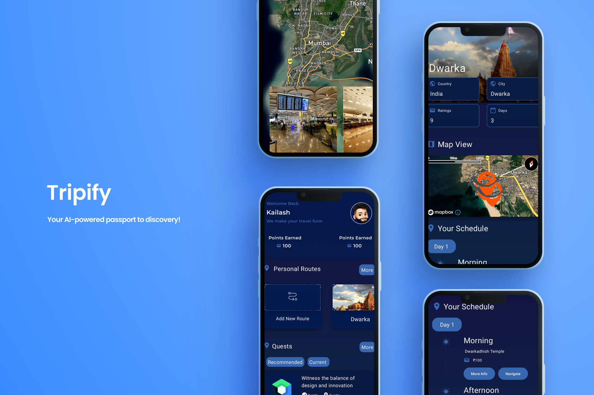
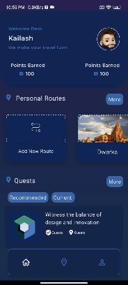
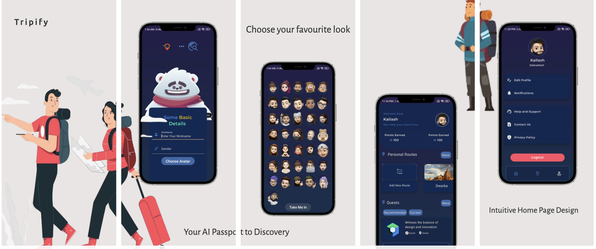
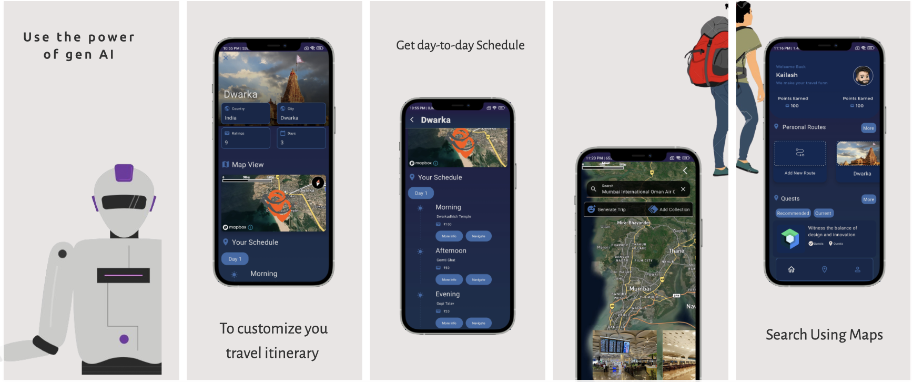

<h1 align="center"> 📲 Tripify ✈️ </h1>  

# Tripify – Your AI passport to discovery

**Available only for Android.**

### Tripify is an AI travel planner revolutionizing journeys. 
Explore hidden gems, discover new places, engage in captivating events, and share your own travel stories with Tripify.

- 🌆  A fingertip pulse on your city: Never miss a beat with real-time updates on `Local happenings` and exciting events
- 🔄  A platform to `Create and Share`: Document your adventures and inspire others with your travel experiences.
- 🌍  A gateway to endless exploration: Explore everything you've ever dreamed of, all in one place with the power of `Tripify` and `HERE API`.
- 📅  Plan your perfect trip: Build personalized `Itineraries` based on your `Interests`, `Budget`, and `Travel-Style` using the `Power of AI`.

## Demo Video
__________________
> Demo Video Link: [Click here](https://youtu.be/ipniPvVFRyY?feature=shared)

## Map your moments, live your itinerary

| Preview  | Full Search  |
|----------|--------------|
|  |  |

## Features ✏️

1. 🗺  **Discovery** - Explore a map powered by `HERE API` showcasing various places.
2. 📱 **Geo-Memories** - Create `location-based` memory blocks with media integration.
3. 📅  **Curated Plans** -Tailored `itineraries` based on interests, budgets, and destinations using `AI`.
4. 🧭  **Navigate** - Get `real-time directions` for walking, biking, driving, or public transport.

## Let's have a look

| Uses of Here API    |
|--------------------------|
| 1. Geocoding          |
| 2. Reverse Geocoding     |
| 3. Nearby hotels         |
| 4. Nearby tourist attractions |
| 5. Here AutoSuggest |

### Tech Stack
| Name | Description |
| --- | --- |
| [`@palm-llm`](https://makersuite.google.com) | Palm API 2 |
| [`@here-api`](https://www.here.com/docs/) | Here API |
| [`@mapbox`](https://docs.mapbox.com/) | Mapbox |
| [`@compose`](https://developer.android.com/jetpack/compose) | Jetpack Compose |
| [`@materialUI`](https://m3.material.io/) | Material 3 |
| [`@ktor-client`](https://ktor.io/docs/create-client.html) | Ktor CLient |
| [`@navigation-compose`](https://developer.android.com/jetpack/compose/navigation) | Navigation Compose |
| [`@coil`](https://coil-kt.github.io/coil/compose/) | Coil-Compose |
| [`@ksp-room`](https://developer.android.com/build/migrate-to-ksp) | Room Android |
| [`@dagger-hilt`](https://developer.android.com/training/dependency-injection/hilt-android) | Dagger-hilt |

## Steps To Run on your Device
- The Following project was build using `AGP 8.1.0`
-  Check your Android Studio's AGP.
-  If it is `lower` than given AGP follow given steps :-
-  -  #### Go to gradle/libs.version.toml
   -  #### In [versions] change value of AGP as per requirement

## Steps To Install on your Device
- Visit the following link 
- [Install Now](https://drive.google.com/drive/folders/1_IQ9iA7CroncRSsy5x06kdQ4sjPRhHW_?usp=drive_link)
- Minimum SDK `27` --> `Android version 8.1`

